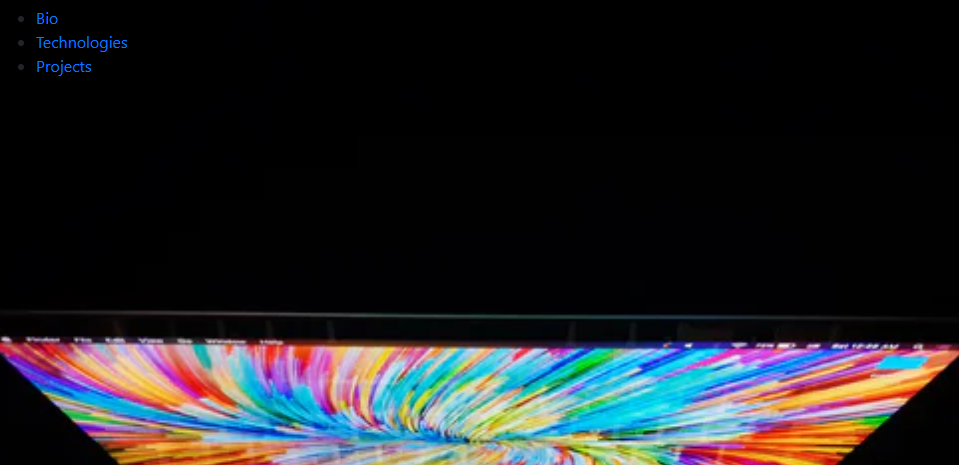

# personal-bio-site
## Description -- 
This is a biography about me.  My work history, the technologies I have learned and the projects I have finished.

## Screen shots

## Instructions how to run
1.  Clone down the repo.
2. Make sure you have http - server installed via npm.  If not, get it [here](https://www.npmjs.com/package/http-server)
3. On your command line run `hs -p 9999`.
4.  Navigate to local host `http://localhost:9999`
5.  https://personal-bio-site-96604.web.app
